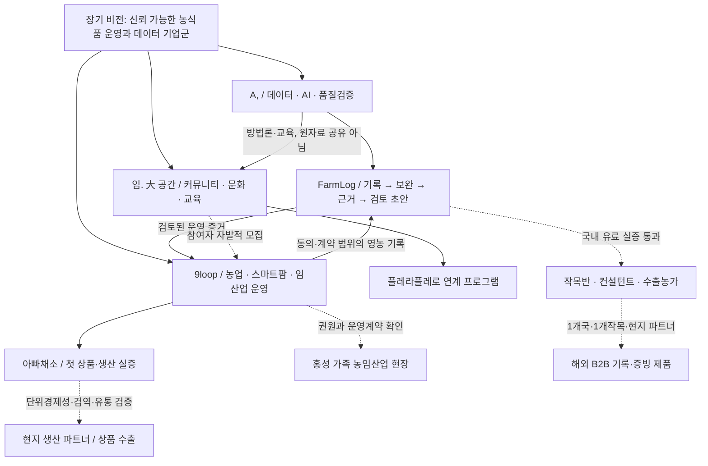

# 팜로그 중심 글로벌 사업 구상 v0.1

작성: 2026-09-07 KST · 내부 전략 제안 · 사업체 설립·자산 편입·시장검증 완료를 뜻하지 않음

## 1. 결론: 하나의 거대한 앱이 아니라, 연결되는 세 사업축

**농업 현장의 일을 신뢰할 수 있는 데이터로 바꾸고, 그 데이터로 생산·거래·교육의 품질을 높이는 기업군**을 목표로 한다.

- **A,**: 데이터·AI 설계와 품질검증. 팜로그의 제품·IP·evals 운영을 담당하는 기술축 제안.
- **9loop**: 스마트팜·농업·임업·가공·현장 체험의 운영축. 이번 사용자 요청에서 새로 지정한 이름이다. 법인 존재나 기존 소유권은 확인하지 않았다.
- **임. 大 공간**: 커뮤니티·문화·교육의 관계축. 기존 플레라플레로 연계 운영 단위를 활용한다.
- **팜로그**: 세 축을 다 넣은 슈퍼앱이 아니라, 농업 기록에서 증빙까지 책임지는 첫 독립 제품.
- **아빠채소**: 9loop의 첫 생산·상품 실증 브랜드 후보. 유아식용 채소·허브·엽채 구독 구상이 있으나 생산·판매·안전성 수치는 미확인.
- **플레라플레로**: 기존 운영 사업. 도시의 판매·체험 접점으로 협업하되 매출·고객정보·사업비를 자동 합산하지 않는다.

이것은 **역할 구조**다. 지주회사·자회사·법인 3개 설립안이 아니다. 기존 A, Labs 편입 구상은 자체 실증 포트폴리오 의미로 읽으며, A,가 가족 자산이나 배우자 사업을 소유한다고 표현하지 않는다.



**운영 원칙:** 비전은 넓게, 실행은 팜로그 하나부터. 신규 9loop·A,·커뮤니티 앱을 각각 만들지 않는다. 기존 L1 세 개 상한은 유지하고, 9loop는 당분간 smartfarm의 사업 설계·실증 연결 레이어로 둔다.

## 2. 현재 가진 것과 없는 것

| 구분 | 확인된 상태 | 사업계획에서의 표현 |
|---|---|---|
| 팜로그 기획 | 저장소 tracked 8개 파일, 기술·Phase 0·UI 문서 존재 | 설계 자산 |
| 기존 실행 코드 | 이번 작업 전 src/package/tests 없음 | 구현 전 단계였음 |
| 실제 영농 데이터 | 연결된 L2 farm-log 디렉터리 일반 파일 0개, 라벨/원본/테스트 없음 | 실증 데이터 미확보, 수치 분석 불가 |
| 실농가 네트워크 | 가족 농지와 외부 인증농가를 타깃으로 기록 | 접근 가능성 가설, 계약·참여 확정 아님 |
| 홍성 자산 | 내부 문서 약 11.7만평 및 농업·산림·식품·문화 자산 기록 | 가족 기반 도메인 접근성, 본인 소유·독립영농 인정 아님 |
| 아빠채소 | 유아식 채소·허브·스마트팜 엽채 구상 | 상품 가설, 매출·인증·저질산 입증 없음 |
| 플레라플레로 | 기존 매장 및 온라인 채널 운영 기록 | 자체/관계 사업 실증 접점, 외부 고객 실적과 구분 |
| 임. 大 공간 | 기존 커뮤니티 운영과 트레바리 시즌 계획 | 운영 기반, 농업 커뮤니티 수요는 별도 검증 |
| A, | AI Business Design Studio / Verify / Canvas·Score·Loop 기획 | 검증 방법론 자산, 공인 인증기관 아님 |
| 9loop | 기존 문서 검색에서 정의 발견 못함 | 이번 사용자 지정 역할, 법인·상표·9의 의미 미확정 |

**따라서 지금 가능한 분석은 데이터 자산·기획 정합성·검증 설계 분석이다.** 수확량 예측, 고객 유지율, 매출 성장률, 농가 정확도 같은 실측은 아직 만들 수 없다. 이번 합성 데이터 평가 결과를 실제 농가 성능으로 쓰지 않는다.

### 기존 계획에서 바로잡을 점

1. Python/FastAPI/Ollama와 Expo/Supabase/외부 API 계획이 공존한다. 이번에는 외부 연결 없는 Node 로컬 검토 도구만 구현하고, 상용 스택 결정은 미룬다.
2. 원문 수정금지와 UI 수정·삭제 계획이 충돌한다. 원본은 보존하고 정정 이벤트를 연결하는 append-only 방식으로 통일한다.
3. 규제 경고를 v0에 넣는 문서와 Phase 2로 미루는 문서가 공존한다. 현재는 **규정 미검증**만 표시하고 약제 적합·부적합을 판정하지 않는다.
4. 예시의 모델명·STT 방언 우위·3초 입력·경쟁사 이용자수는 검증된 근거 없이 사업계획서 사실로 옮기지 않는다.
5. "날짜가 없으면 오늘"도 편의 가정이다. 실제 작업일이 아니므로 추정 출처를 표시하거나 질문해야 한다.
6. "인증 서류가 된다"는 표현은 현재 제품의 사실이 아니다. **인증 준비용 기록·검토 초안**이 정확하다.

## 3. 고객: 농민 한 명과 구매자는 다를 수 있다

### 첫 시장

**한 지역의 한 작목에서, 인증·출하를 위해 정기적으로 기록을 검토받는 5농가와 담당 실무자 1명.**

- 1차 운영 접점: 가족 농지에서 입력·작업흐름을 이해한다.
- 1차 외부 검증: 가족이 아닌 농가 최소 3명. 친분 사용을 제품 수요로 오인하지 않는다.
- 첫 문서: 인증기관/컨설턴트가 실제 요구하는 영농·자재 사용 내역 한 종류. 유기농/GAP 중 실제 수요와 서식 확보 후 선택한다.
- 초기 구매자 가설: 작목반, 영농 컨설턴트, 생산자 조직의 기록 취합 담당자.
- 인증기관은 승인 권한을 가진 검토 파트너일 수 있지만, 곧바로 고객·보증기관이라고 가정하지 않는다.

| 역할 | 하는 일 | 현재 손실 | 제안 가치 | 검증 질문 |
|---|---|---|---|---|
| 농민 | 현장에서 기록 | 늦게 기억해서 입력, 누락 | 20초 내 기록·짧은 보완 | 장갑 낀 상태에서 끝낼 수 있나? |
| 취합 실무자 | 여러 농가 서류 수합 | 연락·엑셀 재입력·근거 찾기 | 누락 큐, 원문과 근거 연결 | 지난 심사 준비에 몇 시간이 들었나? |
| 구매/출하 담당 | 로트·작업 이력 확인 | 이력 공백, 납품 자료 요청 | 검토된 이력 묶음 | 이 자료 없어서 어떤 거래가 지연됐나? |

**팔지 않는 약속:** 잔류농약 사고 방지 보장, 인증 자동 통과, AI 자동 영농 처방, 확정 수확 예측.

## 4. 경쟁 및 차별화 검증

- 파밍노트는 GAP 기준 자동 분류와 선별 인쇄 기능을 소개한다.[W1]
- Farmable은 영농 기록, GLOBALG.A.P. 보고서, 농약 기록, 협업·추적 기능을 소개한다.[W2]
- AGRIVI는 농장·공급망·traceability와 IoT/ERP 연계를 소개한다.[W3]

위 내용은 각 서비스의 **공식 기능 설명**이며, 실제 사용성·정확성·가격 비교 실험은 아니다. 기존 문서의 “경쟁사는 폼 입력뿐”, “이 기능이 유일” 같은 단정은 채택하지 않는다.

**차별화 가설:** 한국어 현장 발화 → 모르는 값은 비움 → 필수 항목만 질문 → 원문·정정·근거 연결 → 실제 검토자의 서식으로 내보내기.

해자는 앱 화면이나 일반 LLM이 아니라 다음의 축적이다.

1. 사용 허락을 받은 작목·발화별 오류 데이터와 라벨 품질.
2. 서식 버전별 필드 매핑과 검토자 피드백.
3. 고객의 실제 절약 시간과 재구매가 확인된 취합 workflow.
4. 규칙 출처·유효일·검증 시각 및 변경 이력.

농가 원자료를 많이 모았다는 이유만으로 독점권·소유권이 생기지는 않는다. 데이터 판매를 초기 BM에 넣지 않는다.

## 5. MVP를 세 단계로 분리

### M0: 이번에 만드는 로컬 검토용 MVP

합성 텍스트 선택 → 역할별 처리 trace → 구조화 baseline → 사람 확인·수정 → append-only 원장 → 내부 검토 초안 → 합성 evals.

- 목적: 사용자에게 전체 workflow를 보여주고 데이터·상태·승인 계약을 검증한다.
- 실제 농가 실증 아님. 음성·사진·LLM·농약 API·인증서식 연동 없음.
- API 키·유료서비스·배포 없이 로컬에서 재현.
- 서류 초안은 공식 행정 양식이 아닌 내부 기록 표이다.

### M1: 2주 concierge, 실제 수요 확인

- 10명 문제 인터뷰, 참여 목표 5농가. 가족농가는 포함하되 외부 농가 참여를 따로 집계.
- 개인정보·동의·보관 경계 확정 후 사람이 받은 기록을 수동 구조화한다.
- 일지 한 건마다 원문, 농가 확정 정답, 수정 이유, 사람 소요시간, 검토자 의견을 분리.
- **진입 게이트: 5명 중 3명이 두 주 모두 기록 지속.** 농작업 없는 날은 미사용이 아니라 작업일 분모로 관리.
- 추가 사업 게이트 제안: 외부 농가 2명 이상 지속, 담당자 1명 반복 검토, 지불의향 인터뷰 3건 및 유료 파일럿 제안 1건. 충족 전 시장검증 완료 주장 금지.
- 5농가×14일이 자동으로 100건이 되는 것은 아니다. 실제 발화 70건 이하일 수 있으므로 수량·누락을 그대로 공개.

### M2: 게이트 통과 후 6주 모바일 MVP

1. 필지·작물 및 최소 권한/동의 관리.
2. 녹음·STT 원문 확인, 실제 기기·사투리 테스트.
3. LLM 구조화 adapter와 held-out evals.
4. 최대 2턴 보완, 저장·정정 이력.
5. 오프라인 큐·동기화 충돌 해결, 사진은 필요성 확인 후.
6. 최대 20농가 베타, 실제 시간·정확도·지원비 측정.

실제 기록 시퀀스 테스트 후 Expo 등 선택. 이번 데스크톱 localhost UI를 현장 오프라인 모바일 앱으로 소개하지 않는다.

### M3: 유료화 확장

실제 공식 서식 1종, 다농가 취합, 권한별 공유, 출처 있는 규칙 adapter를 순차 추가. 농약 검증은 **조회 실패=미확인**이며, 조회 결과 없음을 곧 미등록으로 단정하지 않는다. 안전성 보장이나 자동 사용 추천과 분리한다.

## 6. 서비스 agent의 역할과 권한

```text
Capture → Normalize → Completeness → Human review → Append ledger → Draft export
                                    ↘ unknown/ambiguous → 사람 보완
별도: Evals runner → 회귀 비교 → 배포 판단(사람)
미래: Regulatory adapter → 출처·버전·유효일과 함께 검토 큐
```

| 역할 | 현재 구현 성격 | 후속 연결 | 절대 맡기지 않을 일 |
|---|---|---|---|
| Capture | 합성 fixture 조회 | 음성/STT·사진 | 몰래 녹음·GPS 수집 |
| Normalize | 규칙 기반 baseline | JSON schema 강제 LLM | 들리지 않은 약제·수량 추정 |
| Completeness | 필수값 null 검사 | 한 번에 한 질문 | 질문 무한 반복 |
| Review | 사람 명시 확인 | 농민·담당자 역할 분리 | 자동 인증 승인 |
| Ledger | append-only 저장 | 계정별 DB·감사 로그 | 원문 덮어쓰기 |
| Draft | 결정론적 내부 표 | 승인된 공식 서식 매핑 | 자동 제출 |
| Eval | 합성 회귀 하네스 | 실농가 held-out 평가 | 합성 결과를 실제 성능으로 홍보 |

여러 LLM을 대화시키는 것보다 **서로 독립된 책임과 테스트**가 먼저다. 복잡한 LangGraph·마이크로서비스는 분기·재시도·권한이 실제로 필요해질 때 도입한다.

## 7. 데이터 설계: 관계는 연결하고 원자료는 섞지 않기

### 단계별 데이터 장부

| 층 | 필요한 데이터 | 현재 확보 | 수집 조건·쓸 곳 |
|---|---|---|---|
| 현장 master | 익명 farm/parcel ID, 작목·작기, 면적 | 미확보 | 가족/외부 농가 동의·확인 |
| 기록 event | 작업일, 활동, 수량·단위, 원문, 확인자, 정정 연결 | 이번 합성 예시만 | 작업별 원문 근거 |
| 증거 | 영수증·자재라벨·측정기록 | 미확보 | 개인정보 가림·접근권한 먼저 |
| 규정 | PSIS 코드, 적용작물, 사용기준, 취소정보 | 공식 인터페이스 안내만 확인 | 키/권한/라이선스/응답 검증 후 |
| 유통 batch | 수확 로트, 포장일, 납품·폐기·클레임 | 미확보 | 아빠채소 생산 개시 뒤 |
| 센서 | 온습도/EC/pH/관수·전력 | 미확보 | 시설 확보·교정·결측 기준 후 |
| 고객 | 구독·재주문·프로그램 만족도 | 팜로그와 미연결 | 사업별 분리, 목적별 동의 |

### 공통 계약

`event_id, farm_id, parcel_id, crop_cycle_id, worked_at, timezone, activity_type, amount, unit, raw_input_ref, source, human_reviewed_at, supersedes, schema_version, rule_version, evidence_refs[]`.

현재 M0는 이 중 최소 필드만 구현한다. 날짜, 단위, 농가/필지 코드, 규칙 버전을 처음부터 분리해 두면 해외 확장 때 번역만이 아니라 나라별 adapter를 붙일 수 있다.

- 원문 보존은 사용자 동의·보관기한 내에서만. append-only 기술 원칙이 법적 삭제권을 무효화하지 않는다. 실데이터 저장 전 삭제·비식별화 정책 설계 필요.
- 농가별 tenant 격리, A,는 계약상 처리자 범위에서 접근하는 구조를 우선 검토.
- 학습/평가 2차 이용은 서비스 제공 동의와 분리. 원자료를 A, 자산으로 자동 귀속하지 않는다.
- 임. 大 공간의 독후감·개인 고민·책 전문은 농업 학습셋에 들어가지 않는다.
- 플레라플레로 주문·연락처는 팜로그에 복제하지 않는다. 합의된 비식별 집계만 별도 전달.
- 실농가 성능 평가: 농가·시점 단위로 train/dev/test 분리. 같은 농가의 거의 동일한 발화를 양쪽에 넣어 정확도를 부풀리지 않는다.

PSIS 공식 문서에는 작물·농약·희석·수확 전 사용시기·사용횟수 필드와 별도 등록취소 서비스가 있다. 출처표시+변경금지 이용조건도 명시된다.[W4] 월 1회 캐시만으로 충분하다고 단정하지 말고 원본/파생 판정 분리, 취소정보 갱신, stale 표시, 이용허락 검토를 선행한다.

## 8. 9loop와 아빠채소: 생산 수익과 데이터 수익을 혼동하지 않기

'9'의 의미는 사용자 미확정이므로 억지로 9개 사업을 만들지 않는다. 우선 업무 순환은 **생산 → 기록 → 품질확인 → 출하/판매 → 피드백 → 개선**으로 충분하다.

### 첫 생산 실증

- 작목 1개, 시설/필지 1~2개, 로트 단위 기록부터.
- 파종·정식·관수·시비·수확·폐기·포장·납품을 팜로그의 evidence chain으로 연결.
- 주 지표: 판매가능 수확 kg/㎡, 총 원가/판매 kg, 폐기율, 노동시간/kg, 에너지 원가/kg, 재주문율.
- 아빠채소의 '유아식용', '저질산', '안전한' 약속은 표시기준·검사방법·실측·법적 허용 표현을 확인한 뒤 사용한다. AI가 안전성을 증명해주지 않는다.
- 임산업은 작목·생산주기·인허가가 다르므로 스마트팜 템플릿을 그대로 복사하지 않는다. 산림 임산물/교육·체험 등은 현황 확인 후 별도 domain adapter.

### 단위경제성

`로트 공헌이익 = 매출 - 종묘/자재 - 포장 - 변동노무 - 냉장물류 - 판매수수료 - 검사 - 폐기·반품`.

시설 투자·임차료·고정인건비·대출 원리금·대표자 노동은 별도 현금흐름에 모두 넣는다. 보조금 받은 시설도 감가·교체비가 사라지는 것은 아니다. 부채를 매출처럼 잡지 않는다.

스마트팜 증설 게이트 제안: 적어도 2개 재배주기에서 실측, 양의 로트 공헌이익, 구매처 재주문, 에너지·가격 하락 스트레스 시나리오 확인. 단일 수확 성공이나 지원금 선정만으로 증설하지 않는다.

## 9. 매출 모델: 보조금 없이도 돌아가는 구조

아래 가격은 **인터뷰용 가설**이며 시장가격·계약 실적이 아니다.

| 상품 | 구매자 | 시험 가격 가설 | 검증 |
|---|---|---|---|
| FarmLog 개인 | 기록 의무 농가 | 월 4,900~9,900원 또는 연 결제 비교 | 무료 대안 대비 실제 결제 |
| 취합 workspace | 작목반·컨설턴트 | 기본 월 10만~30만원 + 활성농가당 3,000~1만원 | 농가수·검토시간·지원부담 |
| 유료 실증 | 생산자 조직 | 8주 100만~300만원, 명확한 범위 | 계약·청구·갱신, 무료 LOI와 구분 |
| A, Verify | 외부 사업자 | 별도 견적의 업무별 평가 | 자체 사업 사례를 외부 매출처럼 쓰지 않음 |
| 아빠채소 | 가정·식재료 B2B | 실제 생산원가 기반 | 배송·폐기 포함 공헌이익 |
| 임. 大 공간 | 참가자·파트너 | 기존 운영 가격/정원 기반 | 좌석 공헌이익·재방문 |

기존 연 39,000원은 월 환산 3,250원이다. 사람 지원이 많은 초기 서비스에는 낮을 수 있다.

**가상 산식:** 고객당 월 100건, 건당 AI/STT 5원=500원, 저장·기타 300원, 월 지원 10분×시급 2만원=약 3,333원이라면 직접비 약 4,133원. 연 39,000원은 결제수수료·개발비·세금 전부터 직접비보다 낮다. 이는 단가 가정에 의한 민감도 예시이며 실제 청구서가 아니다.

예시 10개 조직×50농가×월 5,000원=연 3,000만원, 기본료 월 10만원×10개=연 1,200만원. 합계 연 4,200만원은 **규모별 매출 산식**일 뿐 전망이 아니다. 농가 활성률·지원비를 빼면 이익은 더 작다. '국내 전체 농가×가격' TAM보다 실제 접근할 조직 수와 유료 전환율로 SOM을 쌓는다.

## 10. 글로벌 확장: 소프트웨어와 실물을 두 경로로

### 경로 A: 팜로그 소프트웨어, 권장 우선순위

1. 국내 한 작목·한 서식의 유료 반복 사용.
2. 한국 내 수출농가·수출조직의 영문 증빙 요구 확인.
3. 국가와 관계없이 재사용할 event/lot/unit/schema core 정리.
4. 해외 **1개국·1개작목·1개 현지 파트너** PoC.
5. 국가별 언어·단위·약제등록·서식·보관·개인정보 adapter 분리.
6. 한 국가에서 재계약·지원비·오류율을 통과한 뒤 두 번째 국가.

GLOBALG.A.P.는 독립적인 인증기관의 연간 심사를 포함한다. 소프트웨어 보고서가 인증을 대체하지 않는다.[W5] IFA v6 GFS 문서는 기록 관리와 최소 2년 보관(더 긴 요구가 있으면 그에 따름)을 명시한다.[W6] 적용 표준·국가별 요구를 확인해야 하며 국내 GAP와 같은 제도로 취급하지 않는다.

### 경로 B: 9loop·아빠채소 실물

국내 작목 생산성·원가 → 재주문·품질 → 현지 생산 파트너/재배 SOP 협업 → 허용 품목의 소량 수출 또는 현지 생산.

신선 엽채를 한국에서 전 세계로 보내는 모델을 기본값으로 삼지 않는다. 검역·유통기한·콜드체인·폐기 비용을 고려해 **기록 소프트웨어+현지 재배 운영기준**이 먼저 해외로 나갈 수 있다. 신선품 직접 수출과 현지 생산은 별도 손익표를 만든다.

검역증명서는 정부 검역기관 발급·교환 영역이다. 팜로그는 제출 준비자료를 도울 수 있을 뿐 검역증명서를 발급하지 않는다.[W7]

### 1차 국가 선택표, 아직 국가 확정 안 함

| 후보 가설 | 볼 문제 | 주요 미확인 |
|---|---|---|
| 일본 | 가까운 수출농가·고품질 생산조직의 기록 업무 | 실제 파트너, 현지 경쟁, 일본어·약제 DB·보관 규칙 |
| 베트남 등 동남아 1국 | 생산자 조직의 모바일 기록·수출 증빙 | 지불 주체·현지어·통신·파트너 운영 역량 |
| 뉴질랜드/호주 | 영어권 원예·수출 증빙 | Farmable 등 경쟁, 높은 현장지원비, 실제 고객 접근성 |

점수 가중치 제안: **실제 현지 파트너 30%, 유료 문제 25%, 규칙·데이터 접근 20%, 획득/지원비 15%, 언어·개인 네트워크 10%**. 지금은 입력값이 없으므로 임의 점수나 '최적 국가'를 발표하지 않는다. 각국 3명 인터뷰 후 1국을 고른다.

## 11. 90일 실행도와 장기 게이트

날짜는 목표 일정이며 농가 동의·참여·실증 결과에 따라 조정한다.

| 기간 | 팜로그 | 9loop·아빠채소 | 사업·지원 증거 |
|---|---|---|---|
| 9/7~9/13 | 로컬 M0 검토, 필수항목 확정 | 실제 접근 가능한 필지/작목/권원 목록 확인 | 사업자·청년농 연령/예외 사전질의 준비 |
| 9/14~9/27 | 5농가 concierge, 10명 문제 인터뷰 | 1개 작목 생산원가 양식 정의 | 인터뷰·작업일·수동시간·서식 샘플 |
| 9/28 | 3/5 지속 게이트 판단 | 시설 선투자 없음 | 통과/축소/타깃변경 결정 |
| 9/28~11/8 | 통과 때만 6주 M2 | 1~2개 필지 접근계약 검토 | held-out 정확도·실제 20초 목표 검증 |
| 11/9~12/6 | 유료 파일럿 제안·검토 초안 1종 | 생산 가능하면 로트 원가 실측 | 지불·갱신 의향·증빙·지원사업 패키지 |
| 2027 후보 | 국내 조직 유료 확대 | 실측 후 시설/교육/임산업 트랙 | 차기 공고 자격·예산 확인 |
| 이후 | 국내 수출농가→해외 1국 PoC | 현지 생산/제한 수출 실험 | 국가별 손익·재계약 게이트 |

성장 게이트 제안: 조직 3곳 이상 유료 실증 및 재계약 2곳, 8주 활성 사용, 현장지원 포함 양의 공헌이익을 확인한 뒤 전국 확산 비용을 늘린다. 해외는 국내 완전 독점 이후가 아니라 국내 반복성 검증 이후 소규모로 탐색할 수 있다.

**북극성 지표:** '사용량'보다 **한 주에 검토 완료된 증빙 묶음을 실제로 사용하는 유료 조직 수**. 보조 지표: 작업일 기준 기록률, 원문 근거율, 필수 필드 정확도, 수정률, 검토시간 절감, 수금액, 지원비.

## 12. 위험과 즉시 결정할 사항

| 위험 | 대응 |
|---|---|
| 너무 많은 사업 동시 착수 | 9loop/A,는 설계 레이어로 유지, 팜로그 1개 제품 우선 |
| 가족 실증을 시장검증으로 오인 | 외부 농가/유료 조직 별도 집계 |
| 청년농과 SaaS 사업자 자격 충돌 | 등록 전 담당기관 서면 확인, 지원사업 로드맵 참조 |
| 1986년생의 2027 청년농 자격 | 내년 연령·교육 예외 미확정, 확정 재원으로 배치하지 않음 |
| 부모 농지 임차로 독립영농 가정 | 2026 지침 가족임차 제한 확인, 권원·신청 경로 재검토 |
| 위험한 농약·식품 AI 주장 | 불확실=미확인, 사람·공식기준·검사기관 검토 |
| 사업별 데이터·자금 혼합 | 계약·계정·장부·목적별 접근을 분리 |
| 저가 SaaS·큰 시설 투자가 동시에 현금 소모 | 지원시간·원가 실측 뒤 가격/시설 결정 |
| 해외를 번역 작업으로 축소 | 법·약제·서식·현장지원 adapter 검증 |

먼저 필요한 사용자 확인은 세 가지다.
1. 팜로그 테스트가 가능한 **실제 농가/작목 한 곳**과 현재 쓰는 일지·서식 한 종류.
2. 저스팀 명의의 **현재 사업자 보유 여부**와 2027 청년농을 반드시 우선할지.
3. 9loop의 **브랜드/운영 조직 범위**와 기존에 생각한 '9'의 의미 유무.

확인 전에도 로컬 구현·합성 검증은 진행 가능하다. 대신 농가 정보 외부전송, 사업자등록, 계정 신청, 사업 신청, 배포·공개는 하지 않는다.

## 근거

### 내부 자료, 읽은 시점 기준
- `docs/PLAN.md`, `docs/PHASE-0-1.md`, `docs/AGENT-UI.md`.
- `/Users/justimmacbook/Documents/_personal/my_brain/projects/팜로그/00-팜로그-통합정리.md` 및 `02-ai-에이전트-구조.md`, `03-멀티에이전트-그래프-설계.md`.
- 같은 볼트 `wiki/a-comma-브랜드-비즈니스.md`, `wiki/도메인-지형-홍성-광주-본인.md`, `projects/플레라플레로/임대공간/00-임대공간-독서모임-트레바리-커뮤니티.md`.
- `_work/smartfarm/docs/track-C-smartfarm.md`는 8월 계획으로, 지원 자격은 최신 공식 지침과 분리해 읽음.
- 조사된 가족 자산은 내부 기획 진술이며 등기·감정·운영권 실사 아님.

### 외부 자료, 조회 2026-09-07
- [W1 파밍노트 공식 앱 설명](https://play.google.com/store/apps/details?id=kr.co.farmingnote&hl=ko): GAP 자동 분류·선별 인쇄.
- [W2 Farmable 공식](https://farmable.tech/us): 기록·GLOBALG.A.P. 보고서·협업·traceability 설명. 기업 자체 주장으로 취급.
- [W3 AGRIVI 공식](https://www.agrivi.com/products/360-farm-enterprise/): 농장·추적·규정 보고·IoT/ERP.
- [W4 PSIS 공식 API 안내](https://psis.rda.go.kr/psis/cont/contentMain.ps?menuId=PS00381): 사용기준·취소정보·이용허락.
- [W5 GLOBALG.A.P. IFA 공식](https://globalgap.org/what-we-offer/solutions/ifa-fruit-and-vegetables): 독립 인증심사·유효기간.
- [W6 IFA GFS v6 기준 원문](https://documents.globalgap.org/documents/240902_IFA_GFS_PCs_FV_v6_0_Aug24_en.pdf): 문서·기록 통제, 보관 요건. 적용 표준 재확인 필요.
- [W7 농식품부 ePhyto 안내](https://www.mafra.go.kr/bbs/home/792/578393/artclView.do): 정부 검역기관의 전자증명서 발급·교환.

지원사업 공고·자격·등록 충돌은 [FUNDING-ROADMAP.md](FUNDING-ROADMAP.md), 실행 계약은 [MVP-CONTRACT.md](MVP-CONTRACT.md)를 참조한다.
