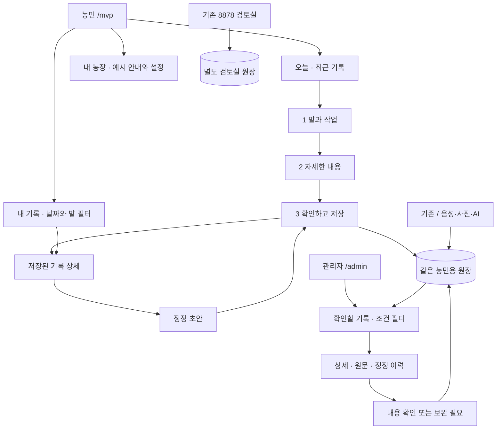
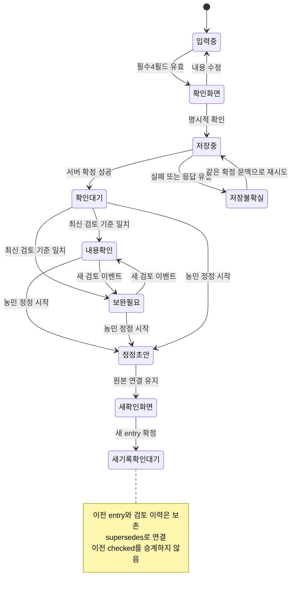

# 팜로그 MVP 공통 기반 구축 계획

- 기준일: 2026년 9월 18일(KST)
- 대상: 가볍고 쉬운 농민 직접 입력 앱, 같은 기록을 보는 관리자, 수정 가능한 공통 코드
- 상태: **구축 목표와 수용 기준**. 실제 구현·검증은 [구축 가이드](BUILD-GUIDE.md)와 [검증 결과](../evidence/WORKSPACE-VERIFICATION.md)가 우선한다. 이 문서만으로 구현·테스트·현장 실증 완료를 선언하지 않는다.
- 근거: [UX 벤치마크](UX-BENCHMARK-2026-09-18.md), [농민 앱 계약](FARMER-APP-CONTRACT.md), [리뉴얼](APP-RENEWAL.md), [기존 계획](PLAN.md), [옵시디언 통합 정본](file:///Users/justimmacbook/Documents/_personal/my_brain/projects/팜로그/00-팜로그-통합정리.md)

## 1. 만들 것과 만들지 않을 것

**농민은 밭과 작업을 고르고, 필요한 내용만 적고, 마지막에 확인한다. 관리자는 같은 기록을 읽고 ‘내용 확인’ 또는 ‘보완 필요’를 남긴다.** 두 화면을 연결하는 정본은 기존 농민용 원장이다.

비유하면 농민용 화면은 간단한 기록 수첩, 관리자 화면은 같은 수첩을 펼쳐 보는 검토 책상이다. 서로 다른 수첩 두 권을 동기화하는 제품이 아니다.

| 경로·영역 | 이번 역할 | 유지 경계 |
|---|---|---|
| `/mvp` | 새 농민용 직접 입력·조회·정정 진입 | 음성 모델·OCR·LLM 없이 핵심 기록 가능하도록 목표 설정 |
| `/admin` | 같은 origin, 같은 단일 농장 일지의 관리자 검토 | 로그인·관리자 권한을 제공하는 이름이 아님 |
| `/` | 기존 음성·사진·AI 농민 앱 | 삭제·대체하지 않음. 기존 실패 대처와 데이터 보존 유지 |
| 8878 검토실 | 기존 합성 데이터·회귀 자산 | 저장소·서버 분리 유지, 새 `/admin`의 정본으로 사용 금지 |
| `.local-data/farmer-app/` | 기존 농민용 일지·세션 정본 | 자동 이관 금지 |
| `.local-data/workspace-preview/` | 이번 최종 시연의 격리 원장 | 농업인·관리자는 이 한 원장을 공유. 실제 데이터가 아닌 합성 시연만 포함 |

런타임 목표는 **새 의존성을 추가하지 않는 HTML/CSS/ES modules, Node.js 22 이상, 기존 backend 재사용**이다. 기존 음성·사진 처리 도구의 의존성까지 없어진다는 뜻은 아니다. 빌드 도구·프레임워크·클라우드·새 DB 도입을 선행조건으로 만들지 않는다.

## 2. 기존 문서와 이번 계획의 우선순위

1. 사용자 현재 요청의 단순 농민 앱과 연동 관리자를 이번 범위로 삼는다.
2. 기존 계약의 필수4필드·원문 보존·명시적 확정·append-only·정정 링크·미기재 `null`은 유지한다.
3. 기존 계약의 `/` 음성·사진·AI 흐름은 보존하며, 직접 입력 경로로 실험의 기준선을 추가한다.
4. PLAN의 Expo·Supabase·클라우드 모델·EXIF/GPS·농약 자동 판정·관리자 웹 제외는 이전 후보 설계다. 이번 구현 완료 항목으로 인용하지 않는다.
5. 옵시디언의 부모 농지·행정 서식·다농가 방향은 사업 맥락이다. 실제 농지 목록·인증 보유·정확 주소·처리 동의는 별도 확인 대상이다.
6. 이 문서는 소스 파일별 구현 완료나 새 API의 세부 JSON 계약을 대신하지 않는다. 실제 구현 보고는 실행 로그·테스트·브라우저 증거와 함께 별도로 남긴다.

## 3. 사용자 과업과 정보 구조

### 3.1 역할별 핵심 과업

| 역할 | 첫 질문 | 해야 하는 일 | 하지 않는 일 |
|---|---|---|---|
| 농민 | 오늘 어디서 무엇을 했나? | 기록·확인·저장·다시 찾기·정정 | 규제 판단·조직 권한·관리자 통계 해석 |
| 관리자 | 어떤 기록을 확인해야 하나? | 범위 필터·원문 대조·보완 사유·내용 확인 | 농민 원본 덮어쓰기·인증 판정·자동 제출 |
| 개발자 | 같은 변경을 몇 곳에서 고치나? | 필드·상태·표시 규칙을 공통 모듈에서 수정 | 화면마다 별도 데이터 계약 복제 |

### 3.2 IA

농민 기본 내비게이션은 ‘오늘’, ‘내 기록’, ‘내 농장’ 정도로 제한한다. 관리자는 ‘기록 검토’를 중심으로 하고 통계·조직관리 메뉴를 미리 늘리지 않는다. 모바일에서 관리자 표는 세로 카드로 바뀌어야 한다.

## 4. 농민 화면 상세 설계

아래 항목은 구현 목표다. 빈 상태와 오류 상태도 정상 화면과 같은 우선순위로 만든다.

| 화면 | 목적·내용 | 주 행동 | 빈 상태 | 오류·전환 규칙 |
|---|---|---|---|---|
| 오늘 | 농장 이름, 오늘 날짜, 최근 기록, 예시 환경 안내 | 기록하기 | ‘아직 기록이 없어요. 첫 기록을 남겨보세요.’ | workspace 실패 시 ‘기록을 불러오지 못했어요’와 재시도. 실패를 0건으로 표시하지 않음 |
| 1. 밭과 작업 | 작업일, 밭, 작물, 작업 종류. 필수4개만 우선 노출 | 다음 | 밭이 없으면 ‘내 농장에서 밭을 추가해 주세요’ | 빠진 필드 옆에 이유 표시. 오늘 날짜는 제안값이며 실제 작업일 확인 가능 |
| 2. 자세한 내용 | 메모, 선택 날씨·시간·인원·수확 등. 추가 항목은 접기 | 내용 확인 | 선택 항목 없이도 다음으로 이동 | 숫자·단위 오류는 해당 칸에 안내. 이전으로 돌아가도 현재 입력 유지 |
| 3. 마지막 확인 | 날짜·밭·작물·작업을 큰 요약, 선택값과 미기재 구분 | 확인하고 저장 | 필수값이 빠지면 해당 단계로 돌아갈 링크 | 마지막 확인 없이 저장 금지. 저장 중 연타 방지, 실패 시 입력과 재시도 맥락 보존 |
| 저장 완료·상세 | 서버가 확정한 기록, 작성시각, 작업일, 관리자 상태 | 기록 보기 또는 목록으로 | ID 없는 성공 화면 금지 | 저장 응답·후속 조회에 근거해 완료 표시. 관리자 대기는 오류가 아님 |
| 내 기록 | 날짜·밭 필터, 최신 유효 기록 카드, 필터 범위·건수 | 기록 선택 | 실제 전체 0건과 필터 결과 0건 구분 | 필터 해제 제공. 조회 실패는 ‘다시 불러오기’, 기존 결과가 남으면 이전 결과임을 표시 |
| 정정 | 원본 요약, 변경할 값, 원본 보존 안내 | 정정 내용 확인 | 정정 대상 없음은 오류로 안내 | 원본을 삭제하지 않음. 저장 성공 시 새 entry와 원본 연결, 새 관리자 확인 대기 |
| 내 농장 | 농장 이름, 밭 별칭·작물, 예시 설명 | 설정 저장 | 실제 정보가 없으면 예시 상태를 명확히 유지 | 기존 일지의 당시 필지명 snapshot을 소급 변경하지 않음 |

### 4.1 3단계 입력의 세부 규칙

- **1단계:** 날짜 기본값과 밭 선택은 편의 제공이지 자동 사실 인정이 아니다. 밭의 기본 작물이 있어도 사용자가 마지막 확인에서 확인할 수 있어야 한다.
- 작업 버튼은 사용자가 이해할 말과 내부 값을 분리할 수 있다. 예: ‘물주기’ 표시와 `관수` 내부 값. 원래 work_type과 출력 용어의 일관성을 검사한다.
- 복수 작업은 기존 계약의 내용 보존 원칙을 따른다. 한 건에 담기 어려우면 별도 기록을 권하되 내용을 버리지 않는다.
- **2단계:** 상세 미입력은 허용한다. 날씨·면적·인원·시간·자재·수확량을 모두 필수로 만들지 않는다. 이번 UI가 지원하지 않는 기존 필드를 정정 과정에서 삭제하지 않는다.
- **3단계:** ‘다음’과 ‘저장’을 혼동시키지 않는다. 필수4필드와 입력한 선택값, 중요한 미기재를 확인할 수 있어야 한다.
- 새로고침·탭 종료 후 임시 입력 복구는 실제 구현을 검증한 범위에서만 약속한다. 기존 `/`의 IndexedDB 큐가 새 `/mvp`에도 자동으로 적용된다고 주장하지 않는다.
- 저장 응답을 못 받은 경우 바로 새 세션으로 재작성하지 않는다. 기존 확정의 idempotency 문맥을 유지해 중복 여부를 확인한다.

## 5. 관리자 화면 상세 설계

| 화면·영역 | 목적 | 표시·조작 | 빈 상태·오류 |
|---|---|---|---|
| 범위와 요약 | 어떤 기록을 보고 있는지 고정 | 단일 농장 이름, 조회 범위, 확인 대기·보완 필요·내용 확인 상태 | 실제 조회 실패와 기록 없음 구분. 전체 건수와 필터 건수 혼동 금지 |
| 검토 목록 | 우선 확인할 기록 찾기 | 날짜·밭·검토상태 필터, 날짜·작물·작업·상태 카드/행 | 해당 상태 0건이면 필터 해제. 첫 결과 자동 승인 금지 |
| 기록 상세 | 구조화 결과와 근거 대조 | 필수4필드, 선택값, 원문, 첨부 존재, 정정 이력 | 원문이 없으면 ‘원문 없음’. 직접 입력 기록에 가짜 발화 만들지 않음 |
| 검토 패널 | 사람의 내용 확인 결과 기록 | ‘내용 확인’, ‘보완 필요’, 보완 사유 | 보완 필요에는 농민이 고칠 지점을 구체적으로 적게 하는 설계. 구현 검증 전 필수 처리 완료 주장 금지 |
| 검토 이력 | 어떤 판단이 언제 바뀌었는지 추적 | append된 검토 결과·시각·사유 | 기존 판단을 덮어쓴 것처럼 표시하지 않음 |
| 충돌 안내 | 오래된 화면의 확인 방지 | 최신 결과 다시 불러오기 | ‘다른 검토 결과가 먼저 저장됐어요. 내용을 다시 확인해 주세요.’ 자동 덮어쓰기 금지 |

### 5.1 상태 용어

| 내부 상태 | 농민·관리자 표시 | 뜻하지 않는 것 |
|---|---|---|
| `pending` | 확인 대기 | 저장 실패, 농민이 확인하지 않았다는 의미 |
| `checked` | 확인 완료 | 인증 완료, 안전 사용 판정, 공식 승인 |
| `needs_changes` | 보완 요청 | 법령 위반 확정, 원본 삭제 |

기존 Entry의 `reviewed:true`는 **농민의 명시적 확인**이다. 관리자의 `checked`와 같은 필드로 합치지 않는다. 규제 상태 `not_checked`도 별개다. `checked`가 되어도 규제 미검토 표시는 바뀌지 않는다.

관리자는 원장을 직접 고쳐 농민 대신 작업 사실을 확정하지 않는다. 보완 사유를 남기고 농민용 정정 흐름으로 연결한다. 알림 발송·이메일·푸시는 이번 범위가 아니다.

## 6. 상태 전이와 일관성

### 불변 조건

1. 일지 정본과 관리자 표시 데이터가 같은 원장의 동일 entry를 가리킨다.
2. 확정 전 session/draft는 저장된 일지와 구분한다.
3. 정정은 새 Entry의 `supersedes`로 연결한다. 원본·원문·이력을 파괴하지 않는다.
4. 기본 목록·집계는 최신 유효 기록 기준이다. 원본과 정정본을 둘 다 현재 건수에 더하지 않는다.
5. 검토는 append 이벤트이며 최신 상태는 그 이벤트들에서 읽는다. 브라우저 localStorage의 색상 변경으로 구현하지 않는다.
6. 관리자 검토에 `expectedReviewId`를 사용한 optimistic concurrency를 적용한다. 오래된 검토 기준은 거부하고 다시 확인하게 한다.
7. 정정본은 새 entry이므로 관리자 상태가 `pending`에서 시작한다. 이전 원본의 확인 결과는 역사로 남긴다.
8. 농민 확인·관리자 내용 확인·규제 판정을 별개 축으로 유지한다.

## 7. 데이터의 사실 경계

| 데이터 | 정본·의미 | 금지 |
|---|---|---|
| 작업일·밭·작물·작업 | 농민이 확인한 필수4필드 | 입력일을 무조건 작업일로 확정 |
| 날씨·면적·인원·시간·수량 | 명시 입력한 선택값, 없으면 `null` | 빈칸을 0·맑음·1명 등으로 채움 |
| 원문 | 직접 입력 내용 또는 기존 확인된 발화 | 관리자가 원문을 꾸며 만들거나 정정으로 제거 |
| 사진·OCR | 참고자료 및 인식 후보 | 라벨 사진을 실제 농약 사용 사실로 인정 |
| 관리자 검토 | 해당 entry 내용에 대한 사람의 판단 | GAP·유기·직불금 적합성 인증 |
| 내보내기 | 선택 범위 최신 유효 기록의 자체 양식 | 공식 기관 접수·인증 완료 표시 |
| 예시 필지 | 기존 ‘3번 하우스/토마토’, ‘윗밭/고추’ | 실제 부모 농지라고 표시 |
| 기획상 필지 | `p1 산성2리`, `p2 천태1리`는 계획·확인 대상 | 기존 profile이나 기록을 자동 migration |

기존 8878 합성 데이터나 사용자의 파일을 농민 원장에 자동 적재하지 않는다. 실제 영농 데이터 도입에는 동의·보관·삭제·모델 처리·접근 통제 검토가 선행한다. loopback 환경도 보안 완성을 뜻하지 않는다.

## 8. 공통 코드 설계: 쉽게 고칠 수 있는 경계

파일명과 실제 배치는 구현자가 확정한다. 아래는 책임 분리 기준이며 새 범용 프레임워크를 만드는 요구가 아니다.

| 공통 단위 | 책임 | 농민에서 사용 | 관리자에서 사용 |
|---|---|---|---|
| 도메인 필드 정의 | 필수4필드·작업 옵션·null 규칙 | 입력·확인 | 상세·필터·검토 |
| 표시 함수 | 날짜·단위·미기재·상태 한국어 | 카드·확인 | 행·상세 |
| API adapter | 요청·오류·재시도 맥락 | session·확정·정정 | workspace·review |
| 입력 검증 | 필수·자료형·범위 | 빠른 사용자 피드백 | 조회 조건 검사 |
| CSS tokens | 배경·본문·강조·간격·터치 크기 | 모바일 중심 | 넓은 목록과 세로 카드 |
| 기본 컴포넌트 | 버튼·라벨·오류·상태배지·일지요약 | 단계별 화면 | 목록·검토 패널 |
| 원장 접근 | 저장·정정·최신 유효 기록·검토 이벤트 | 서버만 | 서버만 |

- 검증의 최종 책임은 서버에 둔다. 공통 프론트 함수를 우회한 요청도 거부되어야 한다.
- 화면별 controller는 분리한다. 농민용 3단계 상태가 관리자 코드에 섞이지 않게 한다.
- 기존 AI·media 모듈은 직접 입력 경로의 필수 의존성이 아니다. 모델 미설치에서도 직접 입력을 시험한다.
- 같은 날짜·작업명·상태 변경은 공통 정의 한 곳을 고치고 양쪽 회귀 검사를 한다.
- 사용자 입력은 text/escape 방식으로 표시하고 HTML로 해석하지 않는다. 기존 출력의 escaping·CSV formula 방어를 후퇴시키지 않는다.
- 읽기 실패를 빈 목록으로 덮지 않고, 서버 오류·validation·충돌·네트워크 문제를 구분해 한국어로 표시한다.

### backend 연결 목표

새 `GET workspace`, `POST manual-sessions`, `POST entries/:id/review`로 직접 입력과 관리자 조회·검토를 잇는다. 검토는 `checked/needs_changes`, 충돌 제어는 `expectedReviewId`가 핵심이다. 정확한 전체 경로·payload·응답·상태코드는 별도 구현 계약을 따른다. 기존 confirm/correct/entries/export 흐름을 가능한 범위에서 재사용하며, 여기서 중복 API 스펙을 만들지 않는다.

## 9. 밝고 간결한 UI와 접근성 목표

| 항목 | 설계 목표 | 검증 방법·경계 |
|---|---|---|
| 배경·색 | 오프화이트 바탕, 세이지 보조색, 진한 글씨 | 실제 대비 측정 전 ‘접근성 충족’ 표시 금지 |
| 본문 | 기본 18px 수준, 줄간격 1.5 안팎, 짧은 한국어 | 글자 확대 200%에서 잘림 검사 |
| 터치 | 최소 48×48 CSS px, 주 CTA는 더 크게 가능 | 버튼뿐 아니라 라디오·필터·닫기 터치영역 확인 |
| 대비 | 일반 본문 4.5:1 이상, 큰 글자·비텍스트 요소 3:1 목표 | 실제 색 조합 측정 필요. 세이지라는 색 이름만으로 충족 아님 |
| 모바일 | 320px 폭에서 본문 수평 스크롤 없이 사용 목표 | 실제 Android·iPhone은 별도 시험, 에뮬레이션과 구분 |
| 키보드 | 논리적 Tab 순서, 선명한 focus, 버튼·라벨 의미 | 마우스 없이 입력→저장→검토 수행 |
| 상태 안내 | 색+한국어 텍스트, 로딩·오류의 보조기기 안내 | 스크린리더 별도 시험, 자동 검사만으로 충분하지 않음 |
| 움직임 | 필수 아닌 애니메이션 최소화, reduced motion 존중 | 전환 때문에 초점·입력 손실 없는지 확인 |
| 고정 CTA | 모바일 하단 주 행동, 본문·오류 가리지 않음 | 키보드 표시·확대·safe area 조건 검사 |

‘고령 친화적’은 설계 목표다. 실제 고령 농민에게 검증하지 않았으면 인증·보장 문구로 쓰지 않는다. 제품의 밝은 UI 요청은 사용자의 Mac 다크 모드 설정을 바꾸라는 뜻이 아니다.

## 10. MVP와 이후 범위

| 영역 | 이번 MVP 목표 | 보류·별도 게이트 |
|---|---|---|
| 입력 | 직접 입력 3단계, 필수4필드, 선택값 | 새 STT/OCR 모델 도입·자동 GPS |
| 기존 AI | `/` 보존, 기존 원장 호환 | 실제 농업 STT 정확도 개선은 별도 평가 |
| 조회 | 같은 원장 목록·상세·날짜/밭 필터 | 복잡한 검색·지도·연간 분석 |
| 관리자 | 단일 농장 검토, 사유·이력·충돌 | 다농가·초대·로그인·역할 기반 접근 통제 |
| 정정 | append-only, supersedes, 검토 초기화 | 원본 삭제·일괄 덮어쓰기 |
| 출력 | 기존 A4/CSV 재사용 여부 검증, 범위 명시 | 새 XLSX 생성기·인증기관별 정식 서식 |
| 연결 | 같은 origin·같은 원장 | 클라우드 동기화·외부 API·실시간 push |
| 운영 | 비민감 로컬 시험 | 실농가 운영·공개 배포·상용 백업·삭제 정책 |
| 기능 확장 | 기록·내용 검토에 집중 | 지원금 신청·재고·결제·판매·회계·농약 자동 판정 |

## 11. 단계별 시공 순서와 완료 조건

| 단계 | 작업 | 단계 종료 증거 | 중단·복구 원칙 |
|---|---|---|---|
| 0. 경계 고정 | 기존 계약·저장소·예시·라우트 확인 | 신규 경로와 기존 경로 영향 목록 | 예시를 실제 필지로 치환하지 않음 |
| 1. 원장 연결 | workspace·manual session·review의 최소 경로 | 같은 entry ID 조회, validation·검토 충돌 테스트 | 원장 손상 시 자동 삭제·초기화 금지 |
| 2. 농민 기본 동선 | 오늘→3단계→저장→내 기록 | 필수 누락·null·실패·중복 재시도 검사 | 저장되지 않았는데 완료 표시 금지 |
| 3. 관리자 왕복 | 상세·원문·검토·정정 확인 | 검토 이벤트 append, 새 정정본 pending | 오래된 화면 검토를 강제로 덮어쓰지 않음 |
| 4. 공통화·화면 검증 | tokens·필드·상태·카드·반응형 | 양쪽 상태 일치, 키보드·좁은 화면 점검 | 과도한 추상화로 기존 `/`를 재작성하지 않음 |
| 5. 회귀·증거 | 기존 경로와 신규 흐름 검증 | 테스트 명령·환경·결과·미검증 목록 | 합성 통과를 실농가 검증으로 합산 금지 |
| 6. 현장 게이트 | 승인된 실제 과업과 기기 시험 | 시간·오류·도움 요청·지속 참여 | 동의·운영정책 전 실데이터 자동 반입 금지 |

각 단계는 파일 생성이 아니라 동작 증거로 끝낸다. 이 문서 작성 시 위 단계들의 통과 여부는 별도 확인 대상이다.

## 12. 테스트와 evals 명세

### 12.1 최소 회귀 시나리오

| ID | 시험 | 기대 결과 |
|---|---|---|
| F01 | 필수4필드만 직접 입력 | 사용자 확인 후 정확한 1건 저장, 선택값 null |
| F02 | 필수값 하나 누락 | 확정 거부, 입력 보존, 빠진 칸 안내 |
| F03 | 잘못된 날짜·숫자 | 서버 거부, 화면 오류와 원입력 유지 |
| F04 | 저장 연타·응답 유실 후 재시도 | 같은 확정 문맥에서 중복 기록 없음 |
| F05 | 모델 미설치·실행 중지 | `/mvp` 직접 입력은 모델 처리에 의존하지 않음 |
| F06 | 필터 결과 0건·조회 실패 | 다른 메시지와 복구 경로 |
| A01 | 농민 저장 후 관리자 재조회 | 동일 entry ID와 필수4필드·원문 일치 |
| A02 | 내용 확인 후 다시 조회 | persisted 검토 이벤트와 상태 일치 |
| A03 | 두 화면의 오래된 검토 | expectedReviewId 불일치 거부, 최신 확인 요구 |
| A04 | 확인된 기록 정정 | 새 entry, supersedes, pending; 원본 검토 보존 |
| A05 | 정정본 목록·집계 | 최신 유효 건만 기본 노출, 이력에서 원본 접근 |
| A06 | checked와 규제 상태 | 규제 not_checked 유지, 인증 완료 문구 없음 |
| D01 | 예시·기획 필지 | 예시 표시 유지, p1/p2 자동 migration 없음 |
| D02 | HTML·스크립트 같은 입력 | 문자로 표시, 실행되지 않음 |
| R01 | 기존 `/`·8878 회귀 | 기존 기능·별도 원장 보존, 합성 자료 혼입 없음 |
| U01 | 키보드·확대·모바일 폭 | 핵심 동선 접근, CTA·오류·초점 가림 없음 |

### 12.2 성과 목표와 분모

- **입력시간 ≤20초:** 기록 시작부터 서버 확정 성공까지를 기본 구간으로 삼는다. 과제별 시간·실패·도움 요청을 함께 남기고 중앙값과 느린 사례를 분리한다. 온보딩 포함/제외, 기기, 네트워크, 경로(`/mvp` 또는 `/`)를 보고한다. 현재 달성 여부는 미측정이다.
- **핵심 필드 정확도 ≥95%:** AI 경로에서 라벨이 있는 날짜·밭·작물·작업 각각의 일치 수/평가 대상 필드 수. 필드별 값과 전체를 함께 보고한다.
- **전체 필드 정확도 ≥90%:** 평가 전에 대상 필드·단위 정규화·null 판정 기준을 고정한다. 선택값이 대부분 비어 정확도가 부풀지 않도록 명시값과 미기재 slice를 나눈다.
- 직접 입력 경로는 **사용자가 확인한 값과 저장·조회 값의 일치**를 검사한다. 이를 AI 추출 정확도 향상으로 주장하지 않는다.
- 불확실한 값을 만들어 넣은 건수, 단위 오류, 원문 손실, 저장 중복, 정정 뒤 과거 checked 승계는 별도 실패 지표다. 치명적 무결성 오류는 평균 정확도로 상쇄하지 않는다.
- AI 평가셋은 합성/실제, 학습·조정용/held-out, 발화/STT/구조화를 구분한다. 동의 없는 원문을 golden dataset으로 승격하지 않는다.
- **5농가 중 3명이 2주 내내 참여하는 기존 게이트는 미통과 상태다.** 로컬 테스트 수나 예시 기록 수로 대체하지 않는다. 실제 모집 전 지속 참여의 기록 기준을 명시한다.

### 12.3 증거 보고 형식

환경·시각·revision·실행 명령·테스트 대상·입력 출처·예상/실제·통과/실패·미검증·증거 경로를 남긴다. 화면 캡처는 비민감 예시로만, 모바일 에뮬레이션은 실제 기기 검증과 구분한다. 공식 API 계약이나 테스트 개수를 이 문서에서 추정해 적지 않는다.

## 13. 운영·보안·되돌리기

- 기존 loopback 바인딩을 유지하고, LAN이나 외부 공개로 바꾸지 않는다. 휴대폰의 `127.0.0.1`은 Mac 서버가 아니므로 실제 휴대폰 접속에는 별도 안전한 연결 검토가 필요하다.
- `/admin` 경로 분리만으로 접근 권한이 생기지 않는다. 인증·농가별 분리가 없는 상태에서 실농가 공개 서비스로 배포하지 않는다.
- 동일 원장의 writer lock과 단일 작성 서버 원칙을 유지한다. 충돌 시 원장을 삭제하거나 lock을 자동 탈취하지 않는다.
- 신규 기능 문제가 생기면 신규 진입을 중단하고 기존 `/`를 보존한다. 이미 추가한 정정·검토 이벤트를 지워 되돌리는 방식을 사용하지 않는다.
- runtime 자료는 git에 넣지 않는다. 실제 보관·삭제·백업·복원 정책을 임의로 신설하지 않는다.
- 규제·인증·공식 서식 자동 제출은 구현 범위 밖이다. 관리자 확인이라는 표현으로 그 한계를 가리지 않는다.

## 14. 8항목 실행 권고

1. **확인된 사실:** 기존 계약은 로컬 농민용 원장·필수4필드·명시적 확정·append-only 정정을 정의한다. 경쟁사 공식 문서는 기록·조회·필터·출력의 연결을 뒷받침한다.
2. **미확인:** 신규 `/mvp`·`/admin`의 실제 완성도, 실제 농민 사용성·기기 성능·입력 20초·필드 정확도 목표는 이 문서로 입증하지 않았다.
3. **프로젝트·단계:** FarmLog L1의 단일 농장 로컬 MVP 기반 구축이다. Phase 0 고객 검증 게이트는 유지한다.
4. **evals 적용점:** 입력부터 관리자 검토와 정정 후 상태 초기화까지를 하나의 데이터 무결성 시나리오로 검사한다.
5. **가장 작은 다음 행동:** 비민감 예시 한 건을 `/mvp`에서 저장하고 `/admin`에서 확인한 뒤 정정한다.
6. **완료 기준·측정:** 동일 entry ID·필수4필드·원문 일치, 검토 append·충돌 거부, 정정 후 새 entry pending과 원본 보존을 재조회로 확인한다. 입력시간은 별도 실측한다.
7. **다른 핵심 프로젝트 영향:** 플레라플레로·임. 大 공간·냥민도감은 수정하지 않는다. 공통 기반은 FarmLog 내부에서만 검증하고 새 전사 프레임워크 작업으로 확대하지 않는다.
8. **실행·보류·보존 권고:** 로컬 왕복 검증은 실행, 다농가·인증·클라우드·지원금·재고·결제는 보류, 기존 `/`와 8878 및 원장은 보존한다. **다음 행동은 비민감 기록 한 건의 농민→관리자→정정 왕복 검증 하나다.**
